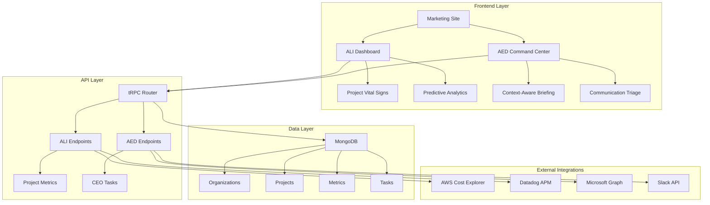

# Aura Platform Documentation

## 🚀 Project Overview

The **Aura Platform** is a comprehensive enterprise-grade SaaS solution that combines **Aura Lifecycle Intelligence (ALI)** and **Aura Executive Dynamics (AED)** modules. Built with a unique "AuraPunk" design system that fuses Palantir's sophisticated data visualization patterns with NobleTech's cyberpunk aesthetic.

## 📋 Table of Contents

- [Architecture Overview](#architecture-overview)
- [Technology Stack](#technology-stack)
- [Design System](#design-system)
- [Module Documentation](#module-documentation)
- [API Documentation](#api-documentation)
- [Database Schema](#database-schema)
- [Development Guide](#development-guide)
- [Deployment Guide](#deployment-guide)
- [Version History](#version-history)

## 🏗️ Architecture Overview

### System Architecture



### Core Modules

#### 1. Aura Lifecycle Intelligence (ALI)
- **Purpose**: Client-facing B2B SaaS for project lifecycle management
- **Users**: Client CTOs, Operations Managers
- **Features**: Real-time project health, predictive analytics, decommissioning planning

#### 2. Aura Executive Dynamics (AED)
- **Purpose**: AI-powered CEO command center
- **Users**: CEO Noble (internal only)
- **Features**: Context-aware briefing, communication triage, focus productivity tools

## 🛠️ Technology Stack

### Frontend
- **Framework**: Next.js 14 (App Router)
- **Language**: TypeScript
- **Styling**: Tailwind CSS + Custom AuraPunk Design System
- **Animations**: Framer Motion
- **Charts**: Tremor (Palantir-inspired), Recharts
- **3D Graphics**: React Three Fiber
- **Icons**: Heroicons

### Backend
- **API**: Next.js API Routes + tRPC
- **Database**: MongoDB with Prisma ORM
- **Authentication**: Clerk (planned)
- **Caching**: Redis (planned)
- **Real-time**: Server-Sent Events (planned)

### External Integrations
- **Cloud**: AWS Cost Explorer
- **Monitoring**: Datadog APM
- **Communication**: Microsoft Graph, Slack API
- **AI/ML**: OpenAI GPT-4, TensorFlow.js

### Infrastructure
- **Hosting**: Vercel (optimized for Next.js)
- **CI/CD**: GitHub Actions
- **Monitoring**: Sentry, PostHog
- **Database**: MongoDB Atlas (production)

## 🎨 Design System

### AuraPunk Theme

The design system combines Palantir's enterprise data visualization patterns with NobleTech's cyberpunk aesthetic:

#### Color Palette
```css
/* Primary Colors */
--aura-background: #0A0E27;        /* Deep navy-black */
--aura-surface: #1A1D2E;           /* Elevated cards */
--aura-surface-elevated: #252A3F;   /* Higher elevation */

/* Accent Colors */
--aura-accent-primary: #00E1F4;     /* Neon cyan - interactive */
--aura-accent-secondary: #7B61FF;   /* Electric purple - secondary */
--aura-accent-critical: #F5A623;    /* Amber - alerts/predictions */
--aura-accent-success: #00FF9F;     /* Neon green - positive metrics */
--aura-accent-danger: #FF006E;      /* Neon magenta - risks */
--aura-accent-warning: #FFD700;     /* Gold - warnings */

/* Text Colors */
--aura-text-primary: #E5E7EB;        /* High contrast text */
--aura-text-secondary: #9CA3AF;    /* Secondary text */
--aura-text-muted: #6B7280;        /* Muted text */
```

#### Typography
- **Display Font**: Chakra Petch (headings, data labels)
- **Body Font**: JetBrains Mono (body text, code-like elements)

#### Effects
- **Neon Glow**: Multi-layered shadow effects for interactive elements
- **Glitch Effects**: Animated text distortion for data anomalies
- **Tech Grid**: Subtle background patterns
- **Glass Morphism**: Frosted glass effects with cyber gradients

## 📊 Module Documentation

### ALI Module - Client Portal

#### Project Vital Signs Dashboard
- **Real-time Metrics**: Uptime %, Error Rate, Cloud Spend MTD, Open Tickets
- **Health Scoring**: Green/Yellow/Red status indicators
- **Trend Analysis**: UP/DOWN/STABLE indicators with color coding
- **Interactive Elements**: Hover effects with neon glow

#### Predictive Analytics
- **TCO Forecasting**: 6/12/24-month cost projections
- **Risk Assessment**: Component failure prediction
- **EOL Planning**: Optimal decommission date recommendations

#### Decommissioning Command Center
- **EOL Planner**: Wizard-style interface for project termination
- **Impact Analysis**: Dependency mapping and cost projections
- **Progress Tracking**: Kanban board for decommission tasks

### AED Module - CEO Command Center

#### Context-Aware Briefing
- **Home Mode**: Deep work focus with virtual meetings
- **Office Mode**: Leadership & collaboration tools
- **Location Detection**: Automatic or manual toggle

#### Executive KPIs
- **Active Projects**: Real-time project count
- **Pipeline Value**: Revenue pipeline tracking
- **Client Health**: Overall client satisfaction score
- **Team Capacity**: Resource utilization metrics

#### Communication Triage
- **Smart Inbox**: AI-powered message prioritization
- **Urgency Scoring**: 1-10 scale for message importance
- **Suggested Actions**: One-click responses and forwarding

#### Focus Productivity Hub
- **Focus Mode**: Distraction-free work environment
- **Pomodoro Timer**: Customizable focus sessions
- **Daily Summary**: End-of-day productivity reports

## 🔌 API Documentation

### tRPC Endpoints

#### ALI Router (`/api/trpc/ali`)

```typescript
// Get project vital signs
getProjectVitals: protectedProcedure
  .input(z.object({ projectId: z.string() }))
  .query(async ({ input }) => {
    // Returns: project health metrics, trends, health score
  })

// Get project timeline
getProjectTimeline: protectedProcedure
  .input(z.object({ 
    projectId: z.string(),
    startDate: z.date().optional(),
    endDate: z.date().optional()
  }))
  .query(async ({ input }) => {
    // Returns: deployment events, incidents, metrics timeline
  })

// Set budget alert
setBudgetAlert: protectedProcedure
  .input(z.object({ 
    projectId: z.string(),
    threshold: z.number()
  }))
  .mutation(async ({ input }) => {
    // Sets budget threshold for alerts
  })

// Get TCO forecast
getTCOForecast: protectedProcedure
  .input(z.object({ 
    projectId: z.string(),
    months: z.number().min(1).max(24).default(12)
  }))
  .query(async ({ input }) => {
    // Returns: cost projections with confidence intervals
  })
```

### Database Models

#### Core Models
- **Organization**: Client companies with Clerk integration
- **User**: All system users with role-based access
- **Project**: Client projects with lifecycle tracking

#### ALI Models
- **ProjectMetrics**: Time-series data (uptime, errors, costs)
- **MaintenanceTicket**: Issue tracking and resolution
- **DecommissionPlan**: EOL planning and execution

#### AED Models
- **CEOTask**: Executive task management
- **CEOContext**: Location and focus mode tracking
- **CommunicationItem**: Email/Slack triage system
- **PredictiveModel**: ML model outputs and forecasts

## 🗄️ Database Schema

### MongoDB Collections

```typescript
// Organization Document
{
  _id: ObjectId,
  name: string,
  domain: string,
  clerkOrgId: string,
  createdAt: Date,
  updatedAt: Date
}

// Project Document
{
  _id: ObjectId,
  name: string,
  description: string,
  status: 'ACTIVE' | 'MAINTENANCE' | 'DECOMMISSIONING' | 'ARCHIVED',
  startDate: Date,
  endDate: Date,
  budget: number,
  organizationId: ObjectId,
  createdAt: Date,
  updatedAt: Date
}

// Project Metrics Document
{
  _id: ObjectId,
  projectId: ObjectId,
  metricType: 'CLOUD_SPEND' | 'UPTIME_PERCENTAGE' | 'ERROR_RATE' | ...,
  value: number,
  unit: string,
  timestamp: Date
}
```

## 🚀 Development Guide

### Prerequisites
- Node.js 18+ 
- npm or yarn
- MongoDB (local or Atlas)

### Installation

```bash
# Clone repository
git clone https://github.com/narindanoble/nobletechinc.git
cd nobletechinc

# Install dependencies
npm install --legacy-peer-deps

# Set up environment
cp .env.example .env.local
# Edit .env.local with your configuration

# Generate Prisma client
npx prisma generate

# Start development server
npm run dev
```

### Available Scripts

```bash
# Development
npm run dev          # Start development server
npm run build        # Build for production
npm run start        # Start production server

# Database
npm run db:test      # Test MongoDB connection
npm run db:seed      # Seed database with sample data
npm run db:reset     # Reset and reseed database

# Code Quality
npm run lint         # Run ESLint
npm run type-check   # Run TypeScript checks
npm run format       # Format code with Prettier
```

### Project Structure

```
src/
├── app/                    # Next.js App Router
│   ├── (marketing)/       # Marketing site
│   ├── ali/               # ALI module routes
│   ├── aed/               # AED module routes
│   └── api/               # API routes
├── components/            # React components
│   ├── aura/             # Shared Aura components
│   ├── ali/              # ALI-specific components
│   └── aed/              # AED-specific components
├── lib/                   # Utilities and configurations
│   ├── trpc/             # tRPC setup
│   ├── prisma/           # Prisma client
│   ├── integrations/     # External API clients
│   └── ml/               # ML utilities
└── styles/               # CSS and design system
```

## 🚀 Deployment Guide

### Environment Setup

#### Required Environment Variables

```bash
# Database
DATABASE_URL="mongodb://localhost:27017/aura_platform"

# Authentication (Clerk)
NEXT_PUBLIC_CLERK_PUBLISHABLE_KEY=""
CLERK_SECRET_KEY=""

# External APIs
AWS_ACCESS_KEY_ID=""
AWS_SECRET_ACCESS_KEY=""
DATADOG_API_KEY=""
MICROSOFT_GRAPH_CLIENT_ID=""
SLACK_BOT_TOKEN=""

# AI/ML
OPENAI_API_KEY=""

# Monitoring
SENTRY_DSN=""
POSTHOG_KEY=""
```

### Vercel Deployment

1. **Connect Repository**: Link GitHub repository to Vercel
2. **Configure Environment**: Set all required environment variables
3. **Database Setup**: Configure MongoDB Atlas connection
4. **Domain Setup**: Configure custom domain (optional)

### Production Checklist

- [ ] Environment variables configured
- [ ] MongoDB Atlas cluster set up
- [ ] Clerk authentication configured
- [ ] External API credentials added
- [ ] Error tracking (Sentry) configured
- [ ] Analytics (PostHog) configured
- [ ] Security audit completed
- [ ] Performance testing completed

## 📈 Version History

### v1.0.0 - Foundation (Current)
- ✅ Next.js 14 with App Router
- ✅ TypeScript configuration
- ✅ Tailwind CSS with AuraPunk design system
- ✅ MongoDB integration with Prisma
- ✅ tRPC API setup
- ✅ ALI dashboard with mock data
- ✅ AED command center with mock data
- ✅ Navigation system
- ✅ Responsive design

### v1.1.0 - Authentication (Planned)
- [ ] Clerk integration
- [ ] Role-based access control
- [ ] User management
- [ ] Organization management

### v1.2.0 - Real Data Integration (Planned)
- [ ] AWS Cost Explorer integration
- [ ] Datadog APM integration
- [ ] Microsoft Graph API integration
- [ ] Slack API integration

### v1.3.0 - AI Features (Planned)
- [ ] OpenAI GPT-4 integration
- [ ] Predictive analytics
- [ ] Communication triage
- [ ] Focus mode enhancements

### v2.0.0 - Advanced Features (Planned)
- [ ] Real-time data pipelines
- [ ] Advanced ML models
- [ ] 3D data visualizations
- [ ] Mobile applications

## 🤝 Contributing

### Development Workflow

1. **Fork Repository**: Create your own fork
2. **Create Branch**: `git checkout -b feature/your-feature`
3. **Make Changes**: Implement your feature
4. **Test Changes**: Ensure all tests pass
5. **Commit Changes**: Use conventional commit messages
6. **Push Changes**: Push to your fork
7. **Create PR**: Submit pull request for review

### Code Standards

- **TypeScript**: Strict mode enabled
- **ESLint**: Configured with Next.js rules
- **Prettier**: Code formatting
- **Conventional Commits**: Standardized commit messages
- **Component Structure**: Functional components with hooks

## 📞 Support

### Documentation
- **README**: This file
- **API Docs**: `/docs/api.md`
- **Component Docs**: `/docs/components.md`
- **Deployment Guide**: `/docs/deployment.md`

### Issues
- **Bug Reports**: Use GitHub Issues
- **Feature Requests**: Use GitHub Discussions
- **Security Issues**: Contact directly

### Contact
- **Email**: noble@nobletechinc.com
- **GitHub**: @narindanoble
- **Website**: https://nobletechinc.com

---

**Built with ❤️ by NobleTech Inc.**
